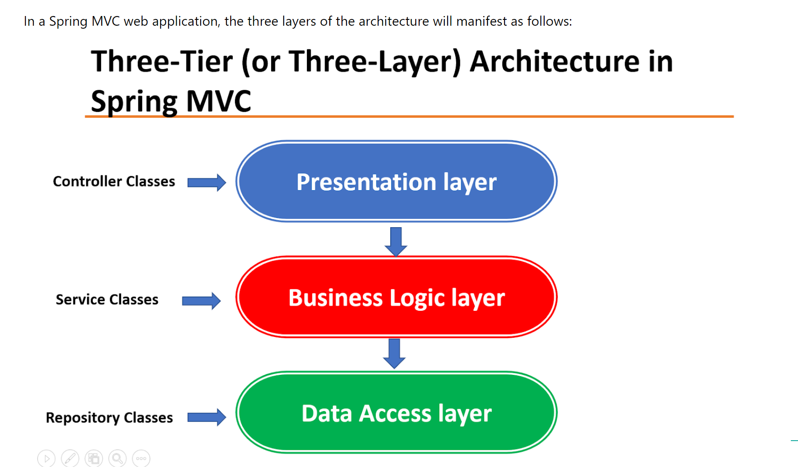

# Ejercicio Gestión Gasolinera

- [Ejercicio Gestión Gasolinera](#ejercicio-gestión-gasolinera)
  - [Enunciado](#enunciado)
  - [Esquema Arquitectura Ejercicio](#esquema-arquitectura-ejercicio)
  - [Esquema General de Arquitectura Web (vProfesor)](#esquema-general-de-arquitectura-web-vprofesor)
  - [Three Tier (Three Layer) Architecture VS MVC Pattern](#three-tier-three-layer-architecture-vs-mvc-pattern)
  - [How to use Three-layer architecture in Spring MVC web applications](#how-to-use-three-layer-architecture-in-spring-mvc-web-applications)
  - [Tabla de los combustibles](#tabla-de-los-combustibles)
  - [Webgrafía](#webgrafía)
    - [Three Tier (Three Layer) Architecture in Spring MVC Web Application](#three-tier-three-layer-architecture-in-spring-mvc-web-application)
    - [How to configure persistence.xml file - Beginner’s Guide to JPA’s persistence.xml](#how-to-configure-persistencexml-file---beginners-guide-to-jpas-persistencexml)
    - [How to generate a UUID](#how-to-generate-a-uuid)
    - [Calendar Class in Java with examples](#calendar-class-in-java-with-examples)
    - [PersistenceUnit vs PersistenceContext (Stackoverflow discussion)](#persistenceunit-vs-persistencecontext-stackoverflow-discussion)
    - [Entity Manager \& Persistence Context (and type = PersistenceContextType)](#entity-manager--persistence-context-and-type--persistencecontexttype)
  - [Solución de errores](#solución-de-errores)
    - [OJO con la versión de Hibernate](#ojo-con-la-versión-de-hibernate)
    - [Hibernate’s “Detached Entity Passed to Persist” Error](#hibernates-detached-entity-passed-to-persist-error)
    - [How to remove a detached instance (Stackoverflow discussion)](#how-to-remove-a-detached-instance-stackoverflow-discussion)
    - [@OneToMany/@ManyToOne(fetch = FetchType.EAGER) - Hibernate could not initialize proxy – no Session](#onetomanymanytoonefetch--fetchtypeeager---hibernate-could-not-initialize-proxy--no-session)
  - [Prueba de Ejecución](#prueba-de-ejecución)

## Enunciado

Desarrollar una aplicación para la gestión de una gasolinera. 
Hay que registrar cada vez que un cliente realiza un repostaje. Existen dos tipos de repostajes:

- NORMAL: se guarda la fecha, la hora y el importe.
- FACTURA: se guarda la fecha, la hora, el importe del repostaje, el DNI del cliente y la matrícula del vehículo.

Además, es necesario llevar el control de cuándo los camiones cisterna rellenan los depósitos de la gasolinera. Cuando esto ocurre, hay que almacenar la cantidad de litros, el tipo de combustible (Gasoil, Gasolina 95 y Gasolina 98) y el importe total del combustible.

Al inicializar la aplicación, deberá aparecer un menú con las siguientes opciones:

1. Repostaje normal.
2. Repostaje factura.
3. Ver todos los repostajes.
4. Importe total combustible vendido.
5. Llenado de depósito.
6. Eliminar último llenado de depósito.
7. Ver todos los llenados de depósito.

- Las dos primeras opciones insertan en la BD.
- La tercera, muestra todos los repostajes que se han realizado.
- La cuarta, visualiza el importe total del combustible vendido hasta la fecha.
- La opción "Llenado de depósito", guarda en la base de datos la información de cuándo un camión cisterna surte de combustible a la gasolinera.
- En caso de que un operario se equivoque al introducir los datos del llenado de depósito, existe la posibilidad de eliminar el último que se ha realizado. 

- La interacción con la aplicación se hará por consola.
- Deberá seguir la arquitectura MVC.
- Los datos que se introduzcan o se muestren por consola vendrán de objetos de tipo DTO. La información que se transfiera a base de datos vendrá de objetos de tipo DAO.
- Los campos fechas se gestionarán con la anotación @Temporal.
- Los campos md_uuid y md_date no pueden ser nulos. 
- Ninguna tipología de campo podrá tomar el valor nulo en base de datos. Valores por defecto: numérico, 0; string, No informado; fecha, 31 de diciembre de 9999 a las 23:59:59.
- En base de datos, el prefijo del nombre de los esquemas hará referencia al nombre de la base de datos (ejemplo, bd_gestor_gasolinera).
- En base de datos, el prefijo del nombre de las tablas de base de datos hará referencia al esquema conceptual (dlk,dwh,dmt) y a la base de datos (ejemplo, dlk_gga_...).
- Toda clase y todo método estarán comentados. En el caso de lo métodos, si existe nivel de interfaz, se comentará a nivel de interfaz.
- Utilizar proyecto maven y JPA.

## Esquema Arquitectura Ejercicio

## Esquema General de Arquitectura Web (vProfesor)

## Three Tier (Three Layer) Architecture VS MVC Pattern

## How to use Three-layer architecture in Spring MVC web applications

## Tabla de los combustibles

## Webgrafía

### Three Tier (Three Layer) Architecture in Spring MVC Web Application
https://www.javaguides.net/2020/07/three-tier-three-layer-architecture-in-spring-mvc-web-application.html

### How to configure persistence.xml file - Beginner’s Guide to JPA’s persistence.xml
https://thorben-janssen.com/jpa-persistence-xml/

### How to generate a UUID
https://www.baeldung.com/java-uuid

### Calendar Class in Java with examples
https://www.geeksforgeeks.org/calendar-class-in-java-with-examples/?ref=lbp

### PersistenceUnit vs PersistenceContext (Stackoverflow discussion)
https://stackoverflow.com/questions/21038706/persistenceunit-vs-persistencecontext

### Entity Manager & Persistence Context (and type = PersistenceContextType)
https://www.oscarblancarteblog.com/2017/02/21/entitymanager-persistencecontext/

## Solución de errores

### OJO con la versión de Hibernate

Las versiones de hibernate más actuales me han dado errores.
Este ejercicio lo he conseguido hacer con la versión de Hibernate 5.6.12.Final.

### Hibernate’s “Detached Entity Passed to Persist” Error
Para solucionar este error, podemos hacer estos dos cambios:

- @ManyToOne(cascade = CascadeType.ALL)	   -->	@ManyToOne(cascade = CascadeType.MERGE)
- entityManager.persist(repostajeVehiculo) -->  entityManager.merge(repostajeVehiculo)
  
https://www.baeldung.com/hibernate-detached-entity-passed-to-persist

### How to remove a detached instance (Stackoverflow discussion)
https://stackoverflow.com/questions/17027398/java-lang-illegalargumentexception-removing-a-detached-instance-com-test-user5

### @OneToMany/@ManyToOne(fetch = FetchType.EAGER) - Hibernate could not initialize proxy – no Session
https://www.baeldung.com/hibernate-initialize-proxy-exception

## Prueba de Ejecución

[Prueba de ejecución Gestión Gasolinera](https://user-images.githubusercontent.com/91122596/214709362-73bcf02d-e273-4b89-ac5e-e6a413752de3.mp4)